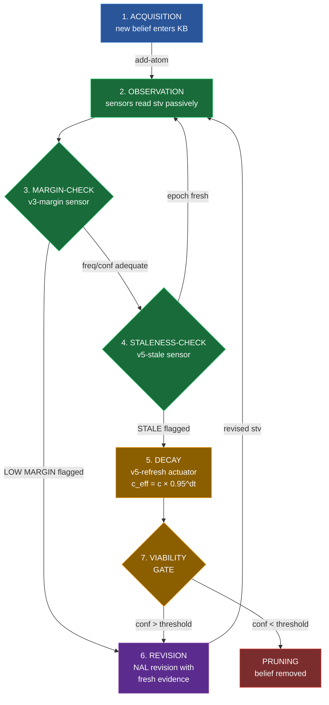

# Belief Lifecycle Visualization

This diagram shows the 7-stage belief lifecycle and where the v4/v5 sensor-actuator architecture operates.

## Layer Legend

| Color | Layer | Components | Role |
|---|---|---|---|
| 🟢 Green | Passive Observation | v3-margin, v5-stale, KB count | Read-only sensor sweep each cycle |
| 🟠 Orange | Deliberative Mutation | v5-refresh, viability gate | Confidence decay and pruning |
| 🟣 Purple | Inference | NAL revision (|-) | Evidence integration raises stv |
| 🔵 Blue | Acquisition | add-atom | New beliefs enter KB |
| 🔴 Red | Removal | remove-atom | Below-threshold beliefs pruned |
