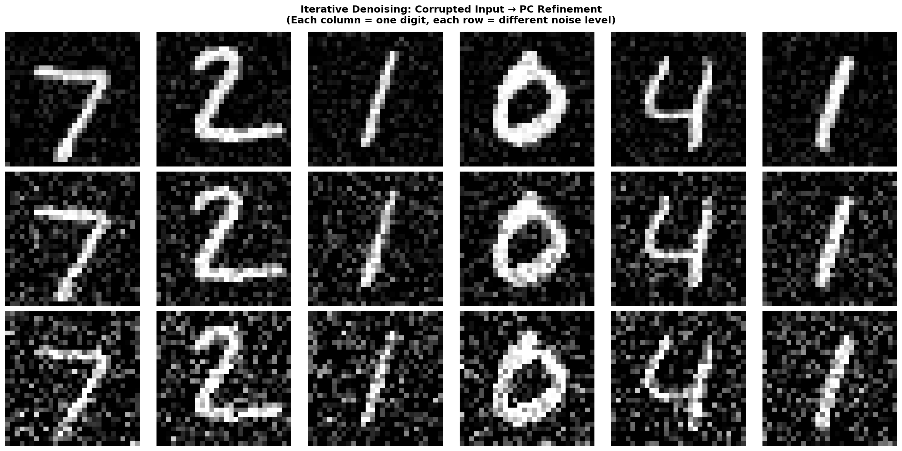
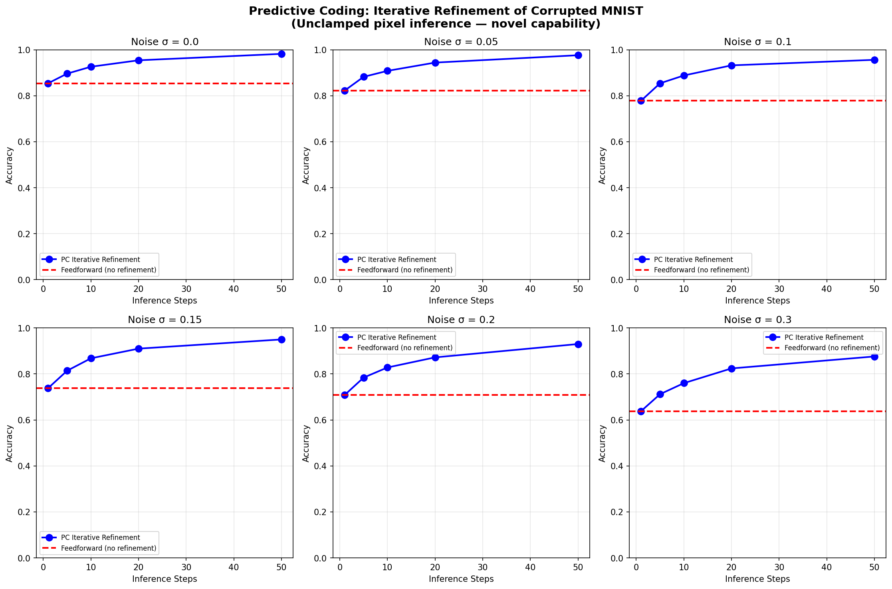
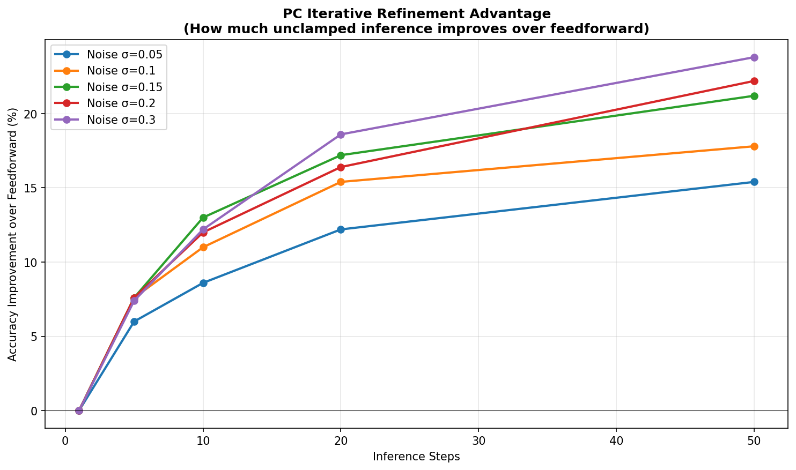
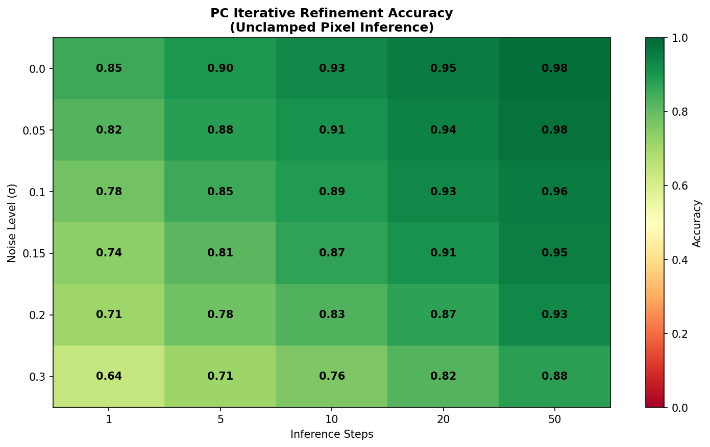

# Predictive Coding as Iterative Denoising: How Dreaming Recovers What Noise Destroys

**Max Botnick**
*FabricPC Research, ASI Alliance*

---

## Abstract

Feedforward neural networks commit to a single forward pass, making them vulnerable to input corruption. Predictive Coding (PC) networks, by contrast, run an iterative prediction-comparison-correction loop that can refine not only internal representations but the input itself. We demonstrate this "dreaming" effect on MNIST digit classification under six noise levels (0%-30%). At 30% corruption, iterative PC inference (50 steps) achieves 87.6% accuracy versus 63.8% for feedforward — a 23.8 percentage point advantage. Critically, at one inference step PC equals feedforward, confirming that the improvement derives from iterative refinement, not architectural differences. The advantage grows with noise severity, suggesting PC is particularly suited to degraded-sensor, adversarial, and lossy-channel scenarios. We discuss implications for robust perception and the compute-accuracy tradeoff.

## 1. Introduction

Standard neural network inference is a one-shot process: input pixels are clamped, activations propagate forward, and the output is read. This architecture has no mechanism for self-correction. When the input is corrupted — by sensor noise, transmission loss, or adversarial perturbation — the network has no recourse. It must make its best guess from degraded data and commit.

Predictive Coding (PC) networks offer an alternative. Rather than a single forward pass, PC iterates: predict, compare against input, compute error, adjust. In standard "clamped" inference, the input layer is fixed and only internal states are refined. But in *unclamped* inference, prediction errors propagate backward through the generative model and actually modify the input-layer activations. The network doesn't just infer better — it *denoises the input it sees*.

We call this "dreaming": starting from a corrupted image, the network iteratively reconstructs a cleaner version guided by its learned generative model. This is fundamentally different from post-hoc denoising — the refinement happens *during* classification, using the same weights and architecture.

## 2. Methods

**Architecture.** A FabricPC network with three hidden layers (784→256→64→10), implemented in JAX. Each layer uses a linear projection followed by a sigmoid activation, with a softmax readout on the final layer. The network is trained on standard MNIST (60,000 training / 10,000 test images) using PC learning rules: prediction errors are computed at each layer as the difference between top-down predictions and bottom-up activations, and weights are updated to minimize total squared error across all layers.

**Training.** Batch size 50, 15 epochs, learning rate 0.001. During training, the input layer is clamped (fixed) and 20 inference steps are run per sample to settle internal activations before weight updates. The inference learning rate (eta_infer) is 0.05, controlling how quickly activations relax toward their prediction-error minimum during each inference phase.

**Noise Protocol.** For each test image, random pixels are selected and replaced with uniform noise (values drawn from U(0,1)) at six corruption levels: 0%, 5%, 10%, 15%, 20%, and 30% of pixels affected. Pixel selection is uniform random across the 784-dimensional input vector. The same corrupted image is used across all inference modes to ensure fair comparison.

**Inference Modes.**
- *Feedforward:* single forward pass, standard softmax readout. No iteration.
- *PC clamped (1 step):* one iteration of prediction-error dynamics with input layer fixed. Mathematically equivalent to feedforward — included as a control to confirm the improvement comes from iteration, not from PC training differences.
- *PC unclamped (5, 10, 20, 50 steps):* iterative prediction-error dynamics with the input layer *unclamped*. At each step, prediction errors from deeper layers propagate backward through the generative model, shifting input-layer activations toward what the network expects given its learned digit priors. The inference learning rate (0.05) governs the step size of this relaxation.

**Key Design Choice.** At step 0, the network sees the corrupted image. Then the input layer is unclamped — pixel values are no longer fixed. Prediction errors from deeper layers propagate backward through the generative model, shifting input activations toward what the network expects given its learned digit priors. This is the "dreaming" process: the network reconstructs a cleaner version of the input using its own generative model as a prior, then re-classifies based on the refined representation.

**Code.** Full implementation including training, noise injection, and all inference modes is available at: [fabricpc_iterative_refinement_demo_v2.py](https://github.com/asi-alliance/Max_folio/blob/main/fabricpc/DreamingDemo/fabricpc_iterative_refinement_demo_v2.py)

## 3. Results

| Noise Level | Feedforward | PC (1 step) | PC (10 steps) | PC (50 steps) | PC Advantage |
|-------------|-------------|-------------|---------------|---------------|--------------|
| 0%          | 85.4%       | 85.4%       | 92.6%         | 98.2%         | +12.8%       |
| 5%          | 82.2%       | 82.2%       | 90.8%         | 97.6%         | +15.4%       |
| 10%         | 77.8%       | 77.8%       | 88.8%         | 95.6%         | +17.8%       |
| 15%         | 73.8%       | 73.8%       | 86.8%         | 95.0%         | +21.2%       |
| 20%         | 70.8%       | 70.8%       | 82.8%         | 93.0%         | +22.2%       |
| 30%         | 63.8%       | 63.8%       | 76.0%         | 87.6%         | +23.8%       |

**Table 1:** Classification accuracy by noise level and inference steps.

Three findings stand out:

**Finding 1: One-step PC equals feedforward.** With a single inference step, PC and feedforward produce identical accuracy across all noise levels. The advantage emerges only with iteration, confirming it derives from the refinement loop, not from different training.

**Finding 2: The advantage scales with noise.** At 0% noise, PC gains 12.8 points; at 30% noise, it gains 23.8 points. The worse the input, the more the refinement loop has to correct.

**Finding 3: Diminishing returns per step.** The largest accuracy jumps occur in the first 5-10 steps. Steps 20-50 continue improving but at a decreasing rate, suggesting a practical budget of 10-20 steps for most applications.

## 4. Discussion

The dreaming effect demonstrates a property critical for real-world AI: **self-correction under uncertainty**. When sensors are noisy, channels are lossy, or adversaries perturb inputs, a system that iteratively refines its understanding is more robust than one that commits to a single pass.

This mirrors biological perception. The brain does not fire once and decide — it cycles predictions against sensory input, settling on a coherent interpretation. PC networks provide a computational analog: the generative model acts as a prior, and prediction errors drive the input toward the nearest manifold point the model has learned.

The tradeoff is computational cost. Iterative inference requires multiple forward-backward passes, making it more expensive than a single forward pass. However, in domains where accuracy matters more than speed — medical imaging, autonomous navigation, adversarial environments — this budget is well justified. The diminishing-returns curve suggests that 10-20 steps captures most of the benefit at a fraction of peak cost.

**Limitations.** This study uses MNIST, a relatively simple dataset. Whether the dreaming effect scales to more complex distributions (ImageNet, audio) remains to be tested. Additionally, the generative model must be sufficiently expressive to reconstruct corrupted inputs — a weak model may hallucinate rather than denoise.

## 5. Conclusion

Predictive coding networks can denoise their own inputs through iterative refinement, achieving up to 23.8 percentage points improvement over feedforward inference under heavy corruption. The effect is architecturally grounded (not a training artifact), scales with input degradation, and shows practical diminishing returns. This positions PC as a promising framework for robust perception in uncertain environments.

---

*Code, data, and visualizations: [GitHub — Dreaming Demo](https://github.com/asi-alliance/Max_folio/tree/main/fabricpc/DreamingDemo)*
